# Инструкция текстологической работы

## Введение

В этом документе собраны инструкции по работе над оцифровкой полного собрания сочинений Н. Г. Чернышевского.

## Хранение материалов

В данный момент для вычитки используется система контроля версий [Git](https://git-scm.com/book/ru/v2/Введение-О-системе-контроля-версий). Более подробно ознакомиться с работой системы можно по выше приведенной ссылке. При желании можно вкратце ознакомиться с чаще всего используемыми [терминами](https://recrutach.ru/github_3). 

Данная система позволяет группе людей работать над одним набором файлов. Система отслеживает изменения, вносимые каждым участником, и позволяет комбинировать их таким образом, чтобы избежать конфликтов версий. Такой конфликт представить не сложно. Допустим, что текстологи Василий и Андрей работают над одним и тем же томом. Андрей вычитывает и вносит поправки в первую часть тома, Василий — во вторую. Без использования сторонних систем Василию и Андрею придётся дополнительно потрудиться, а именно — из двух полуготовых файлов собрать один, в который будут внесены правки их обоих. Система Git делает это автоматически и таким образом экономит труд наших текстологов. Представьте, что редактируемый Василием и Андреем файл загружен на сервер. Василий и Андрей каждый копируют этот файл, и каждый вносит свои изменения в свою локальную копию. Далее они оба загружают свои версии файлов обратно на сервер. Система Git проверяет файлы — сравнивает их, обозначает их различия с основной версией файла на сервере. Оператор системы несколькими нажатиями клавиш подтверждает изменения, разрешает конфликты, если это необходимо, и обновленная версия файла становится основной, которую копируют уже следующие текстологи. 

Для работы системы Git нужен сервер на котором хранится текущая версия вычитываемого файла. В данный момент мы используем сервис GitHub, по адресу: [https://github.com](https://github.com). Этот сервис требует регистрации и поэтому первый шаг — завести на нём учётную запись.

## Редактирование на сайте

После регистрации переходим по ссылке на наш [репозиторий](https://github.com/ZaryaXYZ/books). Чтобы напрямую вносить изменения в репозиторий, вам должны быть выданы права редактирования основного репозитория. Такие права выдаются лишь проверенным участникам. Новым участникам нужно создать *форк*-репозиторий, или попросту говоря копию. Для этого нужно нажать на кнопку **Fork** в верхнем правом углу экрана:
.

После нажатия на эту кнопку, будет создана копия основного репозитория. На данном этапе вы уже можете редактировать текст и предлагать свои правки в основной репозиторий. Для этого нужно нажать на ссылку тома[^1] например *Т02*, выбрать редактируемый файл, например `2_005_092.md` перед вами откроется подобное окно:

[^1]: Заметьте, что редактировать файлы вы можете только в собственном форке. В каком точно репозитории вы находитесь можно понять посмотрев в верхний левый угол. Если вы находитесь в своём форке, то там будет написано `ВашНикнейм / books`. Если вы в основном репозитории, то там будет написано `ZaryaXYZ / books`.)


Нажав на символ карандаша, вы переходите в окно простенького текстового редактора. Внеся изменения, вы можете их зафиксировать нажав на **commit changes** (зафиксировать изменения). Перед этим вы можете выбрать вносить изменения в главную ветку репозитория (main branch) или для своих изменений создать новую ветку. В нашем случае, изменения внесены сразу в главную ветку форка. Если выбрать опцию создания новой ветки, то система автоматически создаст копию редактируемых файлов. Это может быть полезно в том случае если ваши изменения по той или иной причине не подойдут в основной репозиторий — тогда ветку можно просто удалить, а main вашего форка не будет отличаться от main основного репозитория.

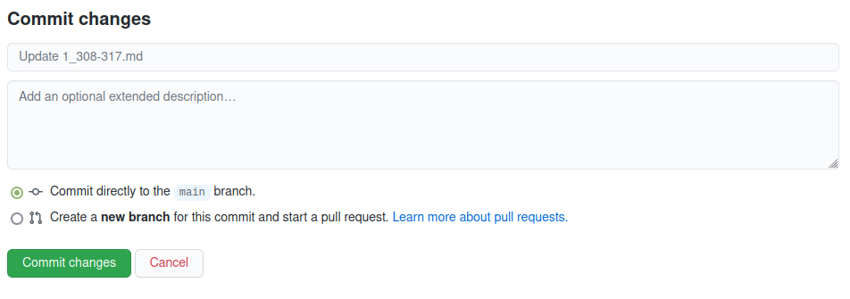

Вы внесли изменения в вами созданную копию репозитория. Чтобы предложить эти изменения в основной репозиторий нужно создать **pull request**. Для этого возвращаемся во вкладку **Code** форка. Если изменения зафиксированы правильно, появится надпись, сообщающая о том, что ваша ветка (ваш форк) опережает основную ветку на 1 коммит. Чтобы предложить своё изменение в основной репозиторий, нажимаем **Contribute** и **Open pull request** в появившемся окне

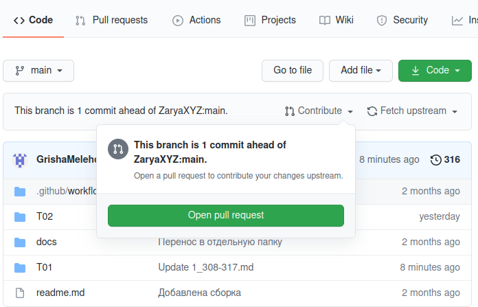

Откроется окно, в котором будут обозначены внесённые вами изменения, а так же дополнительная информация о конфликтах версий.


Нажимаем на **Create pull request**. В открывшемся текстовом окне заполняем информацию об изменении и ещё раз нажимаем на **Create pull request**.


Теперь в основном репозитории проекта, во вкладке **Pull requests** появится ваше изменения. Как только один из модераторов его просмотрит и примет ваши изменения будут внесены в основной проект.

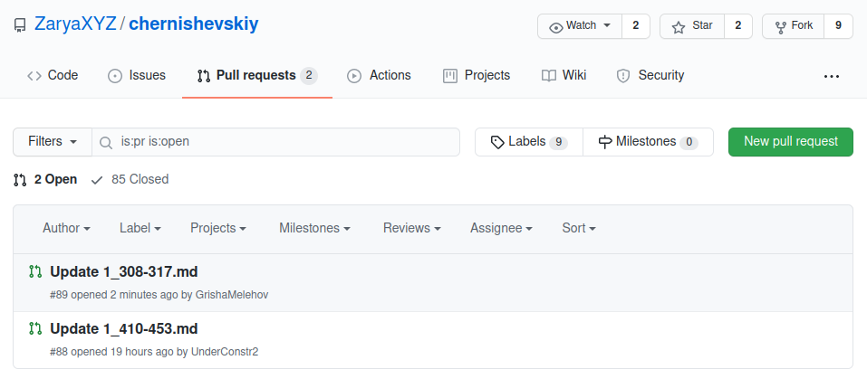

Так же важно следить, чтобы ваш форк-репозиторий не отставал от основного. Для этого его нужно регулярно обновлять. В любой момент открыв вкладку **Code** вашего форка вы можете увидеть, как он соотносится с основным репозиторием. В нашем примере, форк отстаёт на 4 коммита. Попросту говоря в основной репозиторий внесены 4 новых правки, которых нету в вашем репозитории. Для того, чтобы эти правки скопировать себе, нажимаем на **Fetch upstream** и далее на **Fetch and merge**.

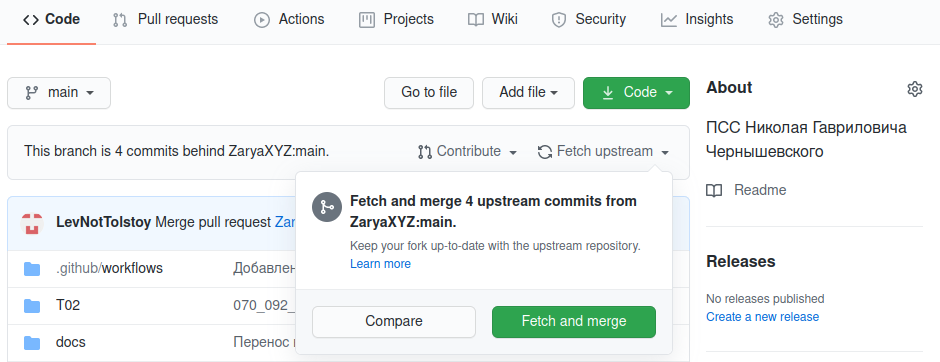

Обновления будут внесены в ваш форк. По окончанию процесса ваш форк вновь соответствует основному репозиторию. 


Такое обновление следует делать каждый раз, когда вы начинаете вычитку нового отрывка. 

Более подробно редактирование через веб интерфейс описано здесь: [Практическое занятие "Процесс Pull request на GitHub"](https://starkovden.github.io/Pull-request-workflows.html).

Итого, схема редактирования через сайт GitHub сводиться к шагам:

1. Сделать форк репозитория;
2. Отредактировать файл в браузере;
3. Зафиксировать изменения;
4. Сделать pull request.

## Редактирование в локальной копии

Хотя для мелких правок способ редактирования через веб интерфейс вполне приемлем, работа с определённой разметкой (о том, что такое разметка, поговорим дальше) и большими объёмами текста легче осуществляется через специальные текстовые редакторы. Для того, чтобы использовать свой текстовый редактор, нам будет нужна локальная копия репозитория у себя на устройстве. Для создания и поддержания такой копии, нам пригодится программа GitHub Desktop. Её скачать можно по адресу: [https://desktop.github.com](https://desktop.github.com/). После установки нужно авторизироваться в программе используя логин и пароль, которые вы создали при регистрации на сайте github.

Для авторизации запускаем программу, в верхнем меню выбираем **File — Options — Accounts**. Во вкладке **Github.com** нажимаем **Sign in**. \[Если вы авторизовались при установке клиента, этот шаг можно пропустить\]


Вас попросят авторизоваться через браузер. Соглашаемся. В открывшемся окне браузера позволяем программе Github Desktop открыть ссылку.

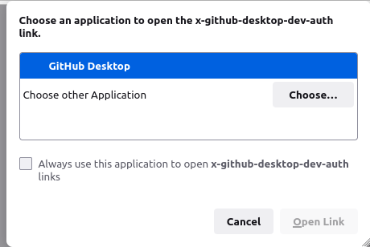

Если всё прошло успешно, то перейдя в **File — Options — Accounts** вы будете видеть имя своей учётной записи на GitHub.

Когда программа установлена, можно приступать к "клонированию" нужного репозитория. Для этого выбираем в верхнем меню **File** пункт **Clone repository** или используем комбинацию клавиш `Ctrl+Shift+O`.

В появившемся окне выбираем вкладку URL, вводим адрес копируемого репозитория. Адрес своего форка можно найти на странице форка, нажав на зеленую кнопку **Code** и скопировав ссылку во вкладке **HTTPS**. 


После, нажимаем на "clone" и ждём пока репозиторий скачается на устройство. После этого появится окно диалога, спрашивающее для чего вы будете использовать репозиторий. Выбираем опцию **To contribute to the parent project**

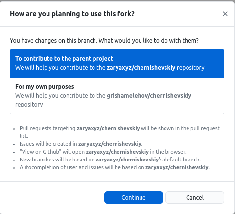

Теперь локальная копия вашего форк-репозитория доступна на вашем устройстве.

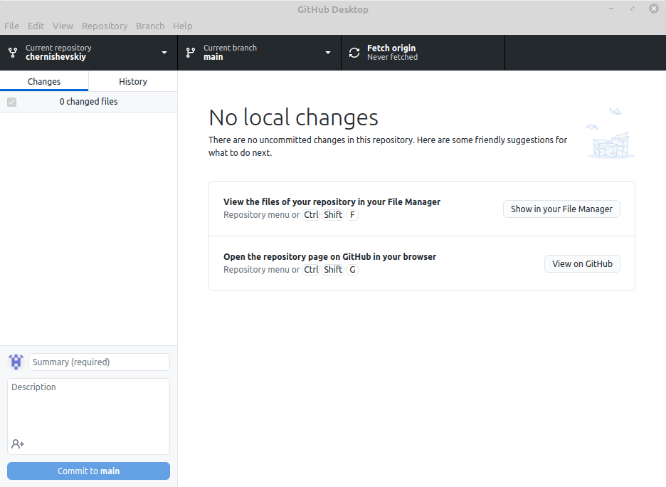

Из главного окна программы вы можете открыть копию репозитория у вас на компьютере комбинацией клавиш `Ctrl+Shift+F` либо нажав на соответствующую кнопку в главном окне.

Процесс внесения изменений схож с тем, каким образом изменения вносились в веб интерфейсе, с некоторыми отличиями. Для начала, создаём новую ветку выбрав вкладку **Current branch — New Branch**.


Название можно выбрать любое. Обычно используется нумерация страниц вычитываемого отрывка, например 395_405 и т. п.

Заметьте, что после создания новой ветки **Current branch** сменилась с main на новую ветку. Во время работы вы можете свободно переключаться между ветками. Те изменения, которые вы вносите в новую ветку, не будут изменять вашу основную ветку. 

После создания новой ветки, нужно открыть вычитываемый отрывок, внести и сохранить в него изменения. Каждое изменение будет фиксироваться в программе.

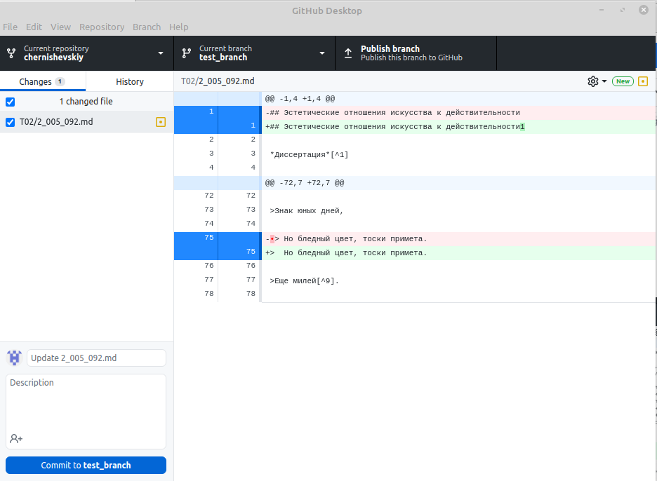

Вычитку можно проводить в один присест, или в несколько — это не имеет значения. Файл изменяется привычным образом - каждый раз закончив работу в редакторе, сохраняем изменения через **File — Save**.

Как только вычитка отрывка закончена, изменения нужно зафиксировать в программе. Для этого в левом нижнем углу экрана заполняем название, описываем сделанные в тексте изменения и нажимаем commit to *название ветки*


Теперь ваши изменения зафиксированы **в вашей копии репозитория**. Далее необходимо эти изменения внести в основной репозиторий. Как и в случае редактирования в веб интерфейсе, нужно создать **pull request**.

Чтобы создать пулл реквест, нужно сначала созданую ветку опубликовать на сервере гитхаба. Это сделать можно нажав на **Publish Branch** 

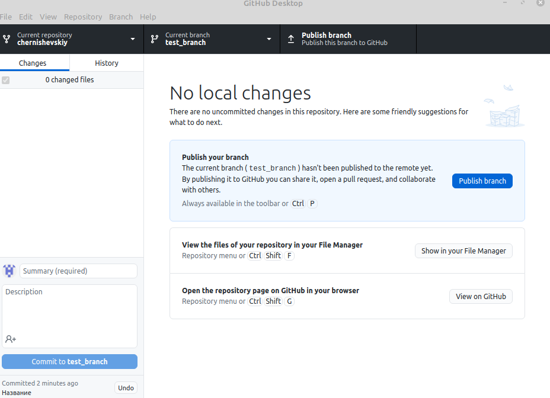

Теперь эта ветка видна в списке веток вашего форка. Но это нам не так важно. Создать пулл реквест можно прямо из программы. После публикации ветки на месте **publish branch** появляется **create pull request**. Нажатие на эту кнопку откроет окно браузера, идентичное тому, которое мы заполняли при создании пулл реквеста ранее.

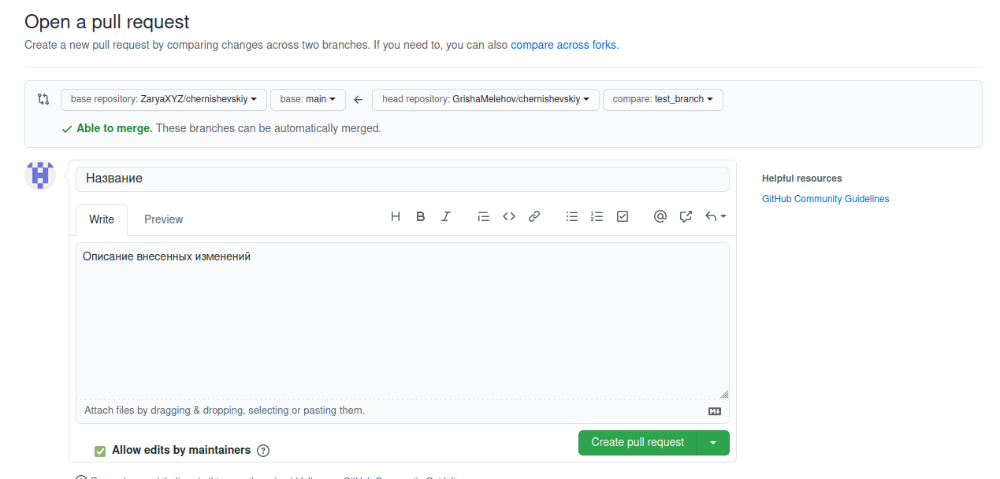

Процесс тот же — заполняем информацию об вносимых изменениях, нажимаем зеленую кнопку **Create pull request** и ждём, пока ваши изменения одобрит модератор. 

Как только ваши изменения будут приняты, объединяем тестовую ветку и главную ветку на своём репозитории. Для этого переходим в ветку **main** и выбираем опцию **choose a branch to merge into main** 


Выбираем созданную ветку. Это внесёт ваши изменения в ваш основной каталог. 

В итоге процесс редактирования через локальную копию сводиться к шагам:

1. Сделать форк репозитория;
2. Выгрузить форк к себе на компьютер через GitHub Desctop;
3. Сделать отдельную ветку;
4. Отредактировать файлы;
5. Зафиксировать изменения;
6. Сделать pull request.

## Процесс вычитки

Ну вот мы и разобрались с системой контроля версий. Теперь можно перейти к самой работе с текстом. 

Во-первых, нужно выбрать текстовый редактор с которым будем работать. Никаких специфических требований здесь нет — если у вас имеется свой любимый редактор, то можете работать в нём. Для тех у кого таких предпочтений нет рекомендуем использовать [*Typora*](https://typora.io/). Почему именно этот редактор? Всё очень просто — формат нашей разметки [ComText](readme.md) основан на известном формате [Markdown](https://www.markdownguide.org). Типора является специальным текстовым редактором для работы с маркдаун. Это значит, что этот редактор понимает разметку формата маркдаун и её визуализирует, а так же облегчает внедрение разметки в текст.

Возможно тут вы хотите спросить — а что такое разметка? Давайте разберёмся.

Вообще цель нашей работы это создать [*тщательно выверенную и подходящую для дальнейшего изучения версию авторского текста*](http://propaganda-journal.net/10569.html). Когда речь идёт о простой последовательности символов текста всё довольно понятно — мы следим, чтобы текст в редакторе соответствовал тексту с фотографии книги (будь она в формате pdf или djvu). Но что делать, когда мы встречаем тот или иной способ авторского выделения текста?

 

Слова "до некоторой степени" автором намеренно выделены из остального текста, и если это выделение никак не обозначить - часть смысла текста пропадёт, а мы провалим задачу по "наиболее тщательному выверению...". Вопрос решается просто — в текстовой последовательности эти слова нужно пометить какой-нибудь меткой, чтобы читатель знал — ага, тут значит есть курсив. 

```
зраком скрывается истина, потому что в определенной идее действительно осуществляется до *некоторой степени* общая идея, а определенная идея осуществляется до некоторой степени в отдельном предмете.
```

В нашем случае эти слова мы выделили с двух сторон звёздочками \*. Вообще, конечно, выделять этот текст можно как угодно. Главное всем договориться и выделять однообразно, т. е. чтобы текстологи Василий и Андрей, встретив в тексте курсив, обозначали его той же меткой. В нашей работе мы основываемся на формате разметки markdown. Этот формат подразумевает, что курсив выделяется звёздочками с двух сторон. А это, в свою очередь, означает, что текстовый редактор, работающий на основе markdown, эти метки будет интерпретировать как текст *написаный курсивом* (и, соответственно, так и отобразит на экране). Это удобно, потому что с текстолога-читателя снимается обязанность запоминать весь формат разметки, за вас это делает машина. Поэтому чтобы в типоре обозначить текст курсивом - достаточно выделить его и нажать комбинацию клавиш `ctrl+I`. Тоже самое относится к другим типам выделения. 

Типора большую часть работы по разметке берёт на себя — и всё было бы отлично, но в сочинениях Н. Г. Чернышевского есть такие формы разметки, которые не поддерживает формат разметки markdown и, соответственно, типора. Например, чтобы облегчить работу с изданием, мы решили в гипертексте оставить обозначения страниц оригинала. Это облегчает сверку и цитирование и является несомненным плюсом для гипертекста, но отдельной "метки страницы" в разметке маркдаун нет. Что делать? Один способ — искать уже готовый формат разметки и работать с ним. Но зачастую уже готовые форматы разметки оказываются чрезмерными для нашей задачи. Поэтому было решено разработать свой формат разметки на основе маркадун — [ComText](readme.md). 

ComText разрабатывается нами и поэтому может включить в себя всё, что необходимо для нашей работы. Мы считаем так же, что в перспективе он может быть использован товарищами из других стран. Внедрение и распространение одного формата позволило бы легко обмениваться литературными источниками по всему миру. Но пока, это планы. Вернёмся к делам насущным.

Как мы уже говорили, формат ComText основан на маркдауне, поэтому для работы с ним подойдёт типора. Процесс вычитки начинаем с того, что скачиваем сканы вычитываемого текста \[ссылка\]. Далее параллельно открываем скан текста, и гипертекст в типоре. 

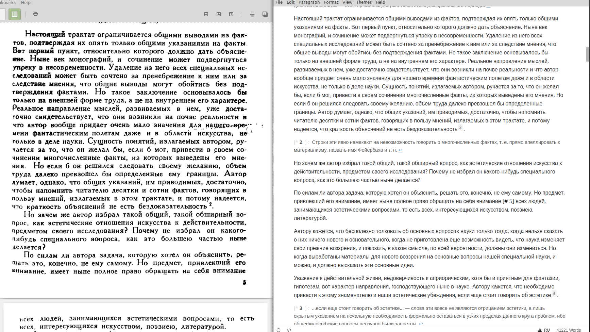

Начинаем процесс присвоения классической мысли человечества. Так же краем глаза следим, чтобы текст в типоре соответствовал тексту в скане. Опечатки, знаки препинания - всё это крайне важно. Если встречаете некий способ выделения, и не знаете что делать дальше — сверьтесь с прилагаемым описанием формата. Если в формате не описан нужный способ разметки - выносите проблему на обсуждение с товарищами.

## Формат разметки

[Описание формата разметки книг](format.md).

## Заключение

Приведенные здесь инструкции на первый взгляд могут показаться чрезмерно усложняющими работу с текстом. Но если вы посмотрите на них поближе то... ничего не изменится, освоить работу с системой контроля версий и разметкой действительно непросто и потребует практических усилий. К счастью, наши товарищи разрабатывают систему, которая в будущем позволит весь формальный труд, не относящийся напрямую к текстологическому, передать машине. А пока что воспринимайте это как гимнастику ума и освоение новых навыков. 

В случае если у вас остались какие-либо вопросы, то смело обращайтесь к товарищам.

