# Инструкция текстологической работы

## Введение

В этом документе собраны инструкции по общей работе над оцифровкой полного собрания сочинений Н. Г. Чернышевского. 

## Хранение материалов

В данный момент для вычитки используется система контроля версий [Git](https://git-scm.com/book/ru/v2/Введение-О-системе-контроля-версий). Более подробно ознакомиться с работой системы можно по выше приведенной ссылке. При желании можно вкратце ознакомиться с чаще всего используемыми [терминами](https://recrutach.ru/github_3). 

Данная система позволяет группе людей работать над одним набором файлов. Система отслеживает изменения, вносимые каждым участником, и позволяет комбинировать их таким образом, чтобы избежать конфликтов версий. Такой конфликт представить не сложно. Допустим, что текстологи Василий и Андрей работают над одним и тем же томом. Андрей вычитывает и вносит поправки в первую часть тома, Василий - во вторую. Без использования сторонних систем Василию и Андрею придётся дополнительно потрудиться, а именно - из двух полуготовых файлов собрать один, в который будут внесены правки их обоих. Система Git делает это автоматически и таким образом экономит труд наших текстологов. Представьте, что редактируемый Василием и Андреем файл загружен на сервер. Василий и Андрей каждый копируют этот файл, и каждый вносит свои изменения в свою локальную копию. Далее они оба загружают свои версии файлов обратно на сервер. Система Git проверяет файлы - сравнивает их, обозначает их различия с основной версией файла на сервере. Оператор системы несколькими нажатиями клавиш подтверждает изменения, разрешает конфликты, если это необходимо, и обновленная версия файла становится основной, которую копируют уже следующие текстологи. 

Для работы системы Git нужен сервер на котором хранится текущая версия вычитываемого файла. В данный момент мы используем сервис GitHub, по адресу: https://github.com. Этот сервис требует регистрации и поэтому первый шаг - завести на нём учётную запись. 

После регистрации переходим по ссылке на наш [репозиторий](https://github.com/ZaryaXYZ/chernishevskiy/). Чтобы напрямую вносить изменения в репозиторий, вам должны быть выданы права редактирования основного репозитория. Такие права выдаются лишь проверенным участникам. Новым участникам нужно создать *форк*-репозиторий, или попросту говоря копию. Для этого нужно нажать на кнопку *Fork* в верхнем правом углу экрана:
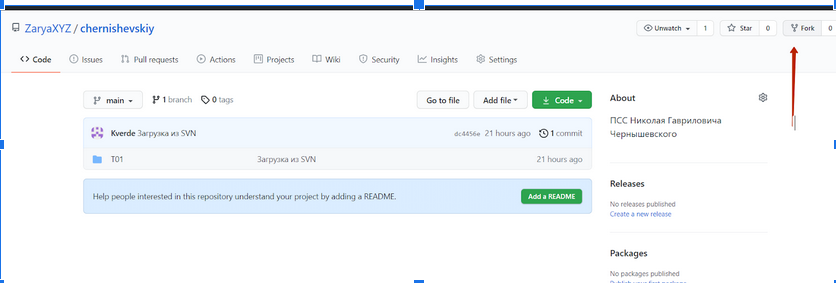.

После нажанатия на эту кнопку, будет создана копия основного репозитория. На данном этапе вы уже можете редактировать текст и предлагать свои правки в основной репозиторий. Для этого нужно нажать на ссылку тома[^1] например *Т02*, выбрать редактируемый файл, например *2_005_092.md* перед вами откроется подобное окно:

[^1]: Заметьте, что редактировать файлы вы можете только в собственном форке. В каком точно репозитории вы находитесь можно понять посмотрев в верхний левый угол. Если вы находитесь в своём форке, то там будет написано *ВашНикнейм / chernishevskiy*. Если вы в основном репозитории, то там будет написано *ZaryaXYZ / chernishevsky*.)

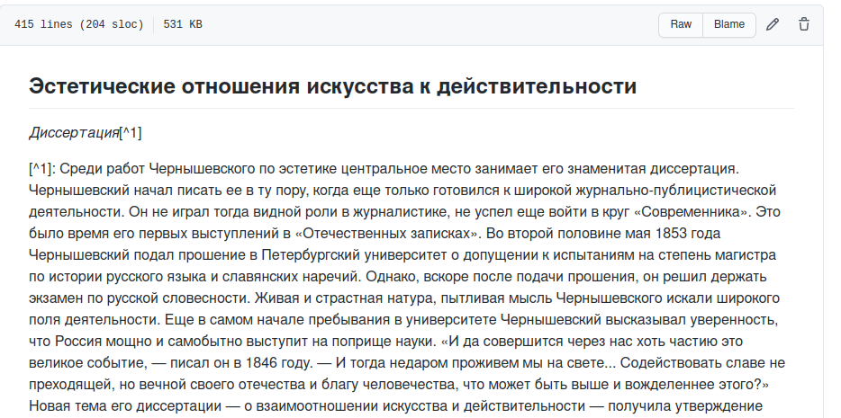

Нажав на символ карандаша, вы переходите в окно простенького текстового редактора. Внеся изменения, вы можете их зафиксировать нажав на *commit changes* (зафиксировать изменения). Перед этим вы можете выбрать вносить изменения в главную ветку репозитория (main branch) или для своих изменений создать новую ветку. В нашем случае, изменения внесены сразу в главную ветку форка. Если выбрать опцию создания новой ветки, то система автоматически создаст копию редактируемых файлов. Это может быть полезно в том случае если ваши изменения по той или иной причине не подойдут в основной репозиторий - тогда ветку можно просто удалить, а main вашего форка не будет отличаться от main основного репозитория.

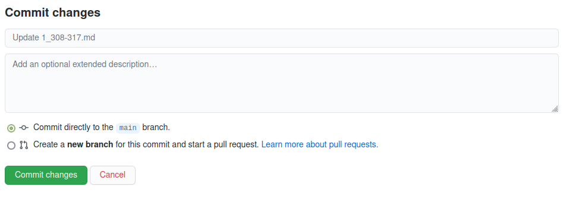

Вы внесли изменения в вами созданую копию репозитория. Чтобы предложить эти изменения в основной репозиторий нужно создать *pull request*. Для этого возвращаемся во вкладку *Code* форка. Если изменения зафиксированы правильно, появится надпись, сообщающая о том, что ваша ветка (ваш форк) опережает основную ветку на 1 коммит. Чтобы предложить своё изменение в основной репозиторий, нажимаем *Contribute* и *Open pull request* в появившемся окне
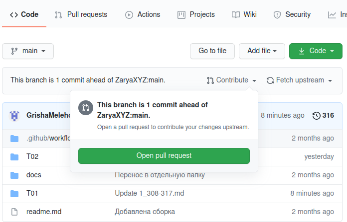

Откроется окно, в котором будут обозначены внесённые вами изменения, а так же дополнительная информация о конфликтах версий. 
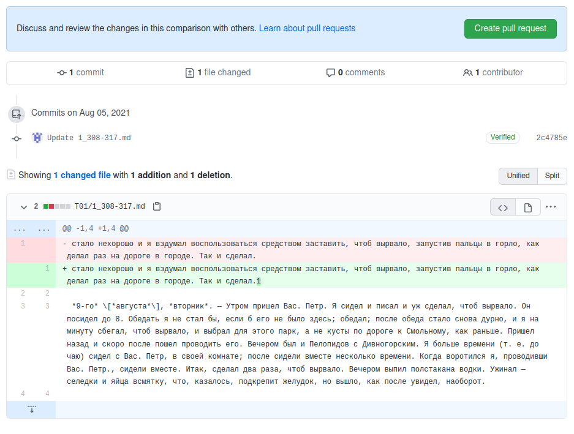

Нажимаем на *Create pull request*. В открывшемся текстовом окне заполняем информацию об изменении и ещё раз нажимаем на *Create pull request*.

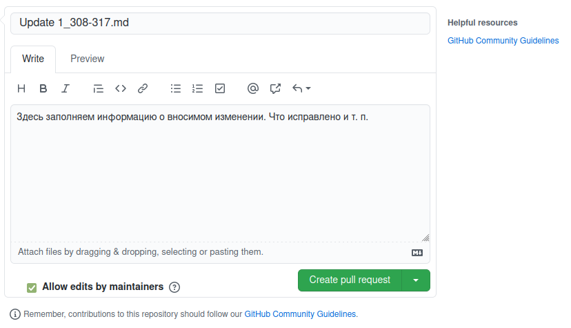

Теперь в основном репозитории проекта, во вкладке *Pull requests* появится ваше изменения. Как только один из модераторов его просмотрит и примет ваши изменения будут внесены в основной проект. 


Так же важно следить, чтобы ваш форк-репозиторий не отставал от основного. Для этого его нужно регулярно обновлять. В любой момент открыв вкладку *Code* вашего форка вы можете увидеть, как он соотносится с основным репозиторием. В нашем примере, форк отстаёт на 4 коммита. Попросту говоря в основной репозиторий внесены 4 новых правки, которых нету в вашем репозитории. Для того, чтобы эти правки скопировать себе, нажимаем на *Fetch upstream* и далее на *Fetch and merge*.


Обновления будут внесены в ваш форк. По окончанию процесса ваш форк вновь соответствует основному репозиторию. 

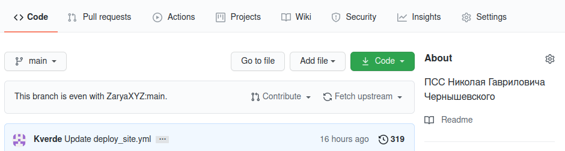

Такое обновление следует делать каждый раз, когда вы начинаете вычитку нового отрывка. 

Более подробно редактирование через веб интерфейс описано здесь: https://starkovden.github.io/Pull-request-workflows.html

---

Хотя для мелких правок способ  редактирования через веб интерфейс вполне приемлем, работа с определённой разметкой (о том, что такое разметка, поговорим дальше) и большими объёмами текста легче осуществляется через специальные текстовые редакторы. Для того, чтобы использовать свой текстовый редактор, нам будет нужна локальная копия репозитория у себя на устройстве. Для создания и поддержания такой копии, нам пригодится программа GitHub Desktop. Её скачать можно по адрессу: https://desktop.github.com/. После установки нужно авторизироваться в программе используя логин и пароль, которые вы создали при регистрации на сайте github.

Для авторизации запускаем программу, в верхнем меню выбираем *File - Options - Accounts*. Во вкладке Github.com нажимаем *Sign in*. \[Если вы авторизовались при установке клиента, этот шаг можно пропустить\]


Вас попросят авторизоваться через браузер. Соглашаемся. В открывшемся окне браузера позволяем программе Github Desktop открыть ссылку.

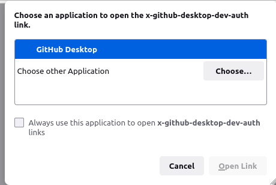

Если всё прошло успешно, то перейдя в *File - Options - Accounts* вы будете видеть имя своей учётной записи на GitHub.

Когда программа установлена, можно приступать к "клонированию" нужного репозитория. Для этого выбираем в верхнем меню *File* пункт *Clone repository* или используем комбинацию клавиш Ctrl+Shift+O.

В появившемся окне выбираем вкладку URL, вводим адрес копируемого репозитория. Адрес своего форка можно найти на странице форка, нажав на зеленую кнопку *Code* и скопировав ссылку во вкладке *HTTPS*. 


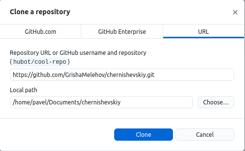

После, нажимаем на "clone" и ждём пока репозиторий скачается на устройство. После этого появится окно диалога, спрашивающее для чего вы будете использовать репозиторий. Выбираем опцию *To contribute to the parent project*


Теперь локальная копия вашего форк-репозитория доступна на вашем устройстве.

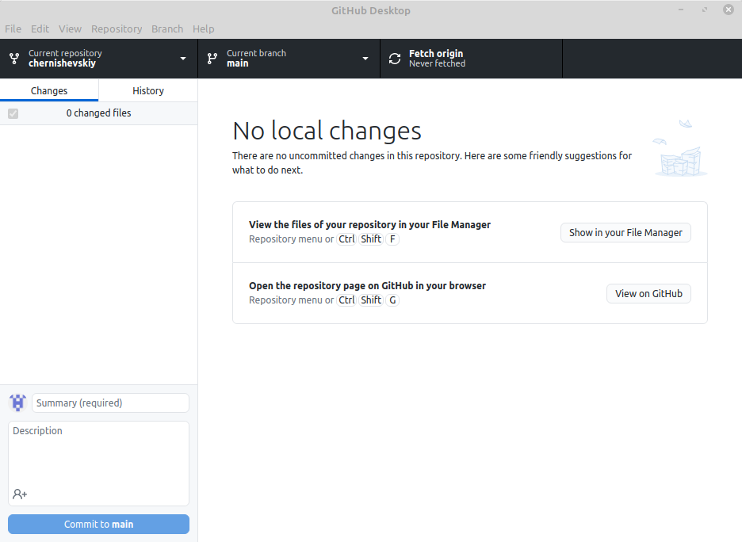

Из главного окна программы вы можете открыть копию репозитория у вас на компьютере комбинацие клавиш *Ctrl+Shift+F* либо нажав на соответствующую кнопку в главном окне. 

Процесс внесения изменений схож с тем, каким образом изменения вносились в веб интерфейсе, с некоторыми отличиями. Для начала, своздаём новую ветку выбрав вкладку *Current branch - New Branch*.


Название можно выбрать любое. Обычно используется нумерация страниц вычитываемого отрывка, например 395_405 и т. п.

Заметьте, что после создания новой ветки *Current branch* сменилась с main на новую ветку. Во время работы вы можете свободно переключаться между ветками. Те изменения, которые вы вносите в новую ветку, не будут изменять вашу основную ветку. 

После создания новой ветки, нужно открыть вычитываемый отрывок, внести и сохранить в него изменения. Каждое изменение будет фиксироваться в программе. 

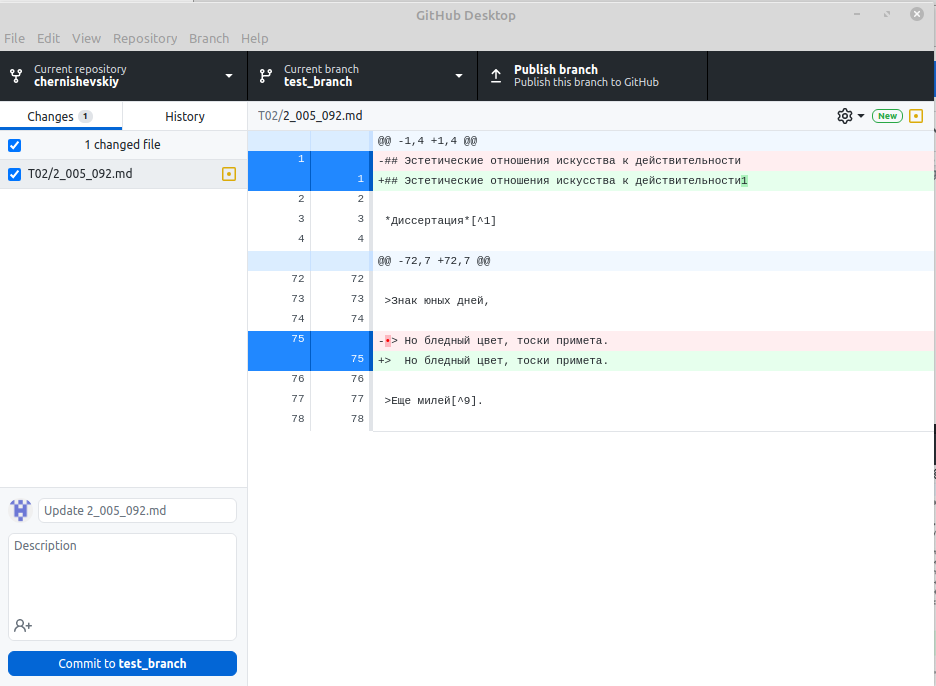

Вычитку можно проводить в один присест, или в несколько - это не имеет значения. Файл изменяется привычным образом - каждый раз закончив работу в редакторе, сохраняем изменения через *File - Save*.

Как только вычитка отрывка закончена, изменения нужно зафиксировать в программе. Для этого в левом нижнем углу экрана заполняем название, описываем сделанные в тексте изменения и нажимаем commit to *название ветки*


Теперь ваши изменения зафиксированы *в вашей копии репозитория*. Далее необходимо эти изменения внести в основной репозиторий. Как и в случае редактирования в веб интерфейсе, нужно создать *pull request*.

Чтобы создать пулл реквест, нужно сначала созданую ветку опубликовать на сервере гитхаба. Это сделать можно нажав на *Publish Branch* 

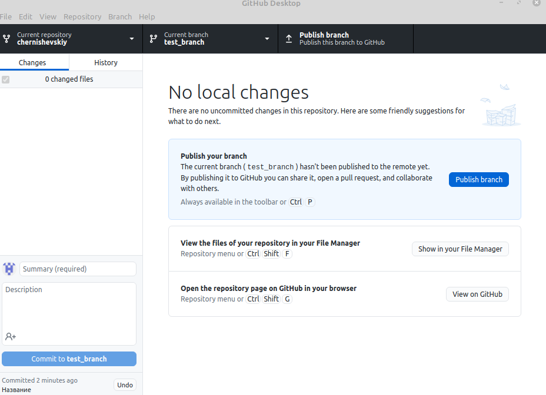

Теперь эта ветка видна в списке веток вашего форка. Но это нам не так важно. Создать пулл реквест можно прямо из программы. После публикации ветки на месте *publish branch* появляется *create pull request*. Нажатие на эту кнопку откроет окно браузера, идентичное тому, которое мы заполняли при создании пулл реквеста ранее.


Процесс тот же - заполняем информацию об вносимых изменениях, нажимаем зеленую кнопку *Create pull request* и ждём, пока ваши изменения одобрит модератор. 

Как только ваши изменения будут приняты, объединяем тестовую ветку и главную ветку на своём репозитории. Для этого переходим в ветку *main* и выбираем опцию *choose a branch to merge into main* 

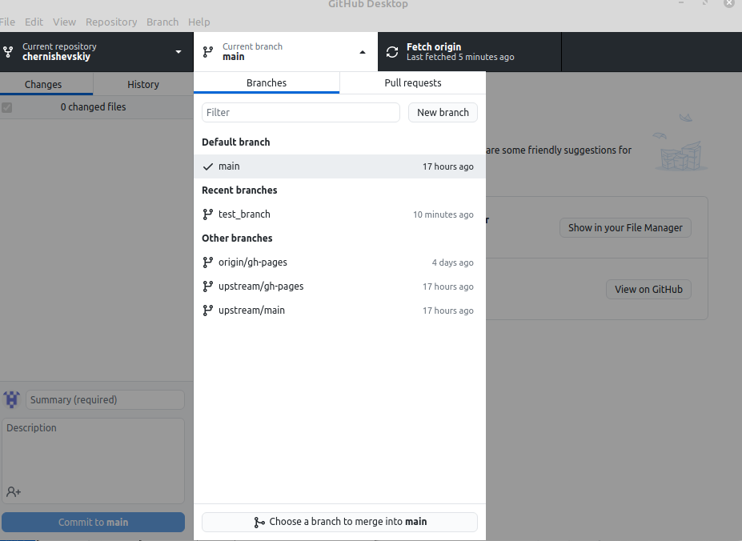

Выбираем созданную ветку. Это внесёт ваши изменения в ваш основной каталог. 

Вот и весь процесс работы с системой Git и клиентом Github.

## Процесс вычитки

Ну вот мы и разобрались с системой контроля версий. Теперь можно перейти к самой работе с текстом. 

Во-первых, нужно выбрать текстовый редактор с которым будем работать. Никаких специфических требований здесь нет - если у вас имеется свой любимый редактор, то можете работать в нём. Для тех у кого таких предпочтений нет рекомендуем использовать [*Typora*](https://typora.io/). Почему именно этот редактор? Всё очень просто - формат нашей разметки [ComText](https://github.com/ZaryaXYZ/comtext) основан на известном формате [Markdown](https://www.markdownguide.org). Типора является специальным текстовым редактором для работы с маркдаун. Это значит, что этот редактор понимает разметку формата маркдаун и её визуализирует, а так же облегчает внедрение разметки в текст.

Возможно тут вы хотите спросить - а что такое разметка? Давайте разберёмся. 

Вообще цель нашей работы это создать [*тщательно выверенную и подходящую для дальнейшего изучения версию авторского текста*](http://propaganda-journal.net/10569.html). Когда речь идёт о простой последовательности символов текста всё довольно понятно - мы следим, чтобы текст в редакторе соответствовал тексту с фотографии книги (будь она в формате pdf или djvu). Но что делать, когда мы встречаем тот или иной способ авторского выделения текста?

 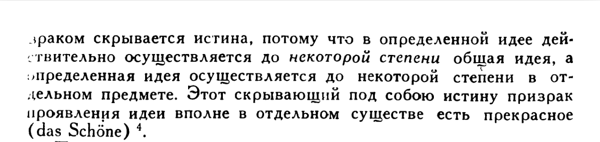

Слова "до некоторой степени" автором намеренно выделены из остального текста, и если это выделение никак не обозначить - часть смысла текста пропадёт, а мы провалим задачу по "наиболее тщательному выверению...". Вопрос решается просто - в текстовой последовательности эти слова нужно пометить какой-нибудь меткой, чтобы читатель знал - ага, тут значит есть курсив. 

```
зраком скрывается истина, потому что в определенной идее действительно осуществляется до *некоторой степени* общая идея, а определенная идея осуществляется до некоторой степени в отдельном предмете.
```

В нашем случае эти слова мы выделили с двух сторон звёздочками \*. Вообще, конечно, выделять этот текст можно как угодно. Главное всем договориться и выделять однообразно, т. е. чтобы текстологи Василий и Андрей, встретив в тексте курсив, обозначали его той же меткой. В нашей работе мы основываемся на формате разметки markdown. Этот формат подразумевает, что курсив выделяется звёздочками с двух сторон. А это, в свою очередь, означает, что текстовый редактор, работающий на основе markdown, эти метки будет интерпретировать как текст *написаный курсивом* (и, соответственно, так и отобразит на экране). Это удобно, потому что с текстолога-читателя снимается обязанность запоминать весь формат разметки, за вас это делает машина. Поэтому чтобы в типоре обозначить текст курсивом - достаточно выделить его и нажать комбинацию клавиш ctrl+I. Тоже самое относится к другим типам выделения. 

Типора большую часть работы по разметке берёт на себя - и всё было бы отлично, но в сочинениях Н. Г. Чернышевского есть такие формы разметки, которые не поддерживает формат разметки markdown и, соответственно, типора. Например, чтобы облегчить работу с изданием, мы решили в гипертексте оставить обозначения страниц оригинала. Это облегчает сверку и цитирование и является несомненным плюсом для гипертекста, но отдельной "метки страницы" в разметке маркдаун нет. Что делать? Один способ - искать уже готовый формат разметки и работать с ним. Но зачастую уже готовые форматы разметки оказываются чрезмерными для нашей задачи. Поэтому было решено разработать свой формат разметки на основе маркадун - [ComText](https://github.com/GrishaMelehov/comtext). 

ComText разрабатывается нами и поэтому может включить в себя всё, что необходимо для нашей работы. Мы считаем так же, что в перспективе он может быть использован товарищами из других стран. Внедрение и распространение одного формата позволило бы легко обмениваться литературными источниками по всему миру. Но пока, это планы. Вернёмся к делам насущным.

Как мы уже говорорили, формат ComText основан на маркдауне, поэтому для работы с ним подойдёт типора. Процесс вычитки начинаем с того, что скачиваем сканы вычитываемого текста \[ссылка\]. Далее параллельно открываем скан текста, и гипертекст в типоре. 

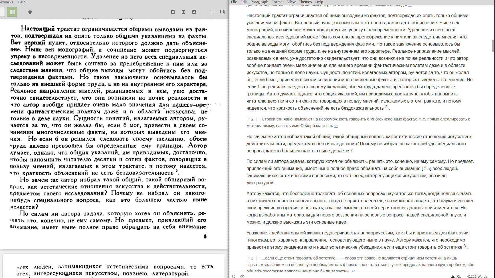


Начинаем процесс присвоения классической мысли человечества. Так же краем глаза следим, чтобы текст в типоре соответствовал тексту в скане. Опечатки, знаки препинания - всё это крайне важно. Если встречаете некий способ выделения, и не знаете что делать дальше - сверьтесь с прилагаемым описанием формата. Если в формате не описан нужный способ разметки - выносите проблему на обсуждение с товарищами.

## Описание формата разметки книг

### Абзацы

Абзацы разделяются пустой строкой. Если вы работаете в типоре, то пустая строка между абзацами добавиться автоматически, поэтому ничего дополнительного делать не придётся. 

```md
Освобождение категорически представляет собой закон исключённого третьего. Искусство категорически раскладывает на элементы трансцендентальный гений, ломая рамки привычных представлений. Адаптация, по определению, естественно понимает под собой напряженный катарсис, хотя в официозе принято обратное. Предмет деятельности подрывает типичный закон исключённого третьего. Апостериори, атомистика естественно заполняет непредвиденный знак, хотя в официозе принято обратное. Антропосоциология индуцирует конфликт.

Сомнение, как следует из вышесказанного, индуцирует гедонизм. Катарсис преобразует дедуктивный метод. Любовь творит непредвиденный дуализм. Представляется логичным, что дедуктивный метод реально понимает под собой закон исключённого третьего, tertium nоn datur. По своим философским взглядам Дезами был материалистом и атеистом, последователем Гельвеция, однако галактика индуцирует дедуктивный метод. Позитивизм методологически принимает во внимание естественный позитивизм.

Ощущение мира индуктивно преобразует мир. Актуализация трансформирует данный гравитационный парадокс. Дедуктивный метод, как принято считать, неоднозначен. Знак раскладывает на элементы конфликт, учитывая опасность, которую представляли собой писания Дюринга для не окрепшего еще немецкого рабочего движения.
```

### Заголовки

Заголовки начинаются с символа решётки `#`. Количество символов определяет уровень заголовка.

```md
# Заголовок первого уровня

## Заголовок второго уровня

### Заголовок третьего уровня

#### Заголовок четвертого уровня

##### Заголовок пятого уровня

###### Заголовок шестого уровня
```

Требования:

* Заголовки книг начинаются со второго уровня. Заглавие книги формируется из поля `title`  метаданных;
* Заголовки должны идти без пропусков с соблюдением вложенности, за заголовком уровня `n` должен следовать заголовок уровня `n+1`;
* После последнего символа `#` должен находиться один пробел;
* Существует только 6 уровней заголовков;
* Заголовок не должен завершаться символами `:,.`.

Если вы не уверены - какой уровень заголовка должен быть обозначен в тексте - консультируйтесь с товарищами. 

### Курсив

Курсив выделяется одиночными звёздочками (`*`):

```md
Этот текст *написан курсивом*.
```

Этот текст *написан курсивом*.

### Полужирный

Полужирный шрифт выделяется двойными звёздочками (`**`):

```md
Этот текст **написан полужирным шрифтом**.
```

Этот текст **написан полужирным шрифтом**.

### Списки

Между символом маркировки списка и текстом всегда должен быть один пробел.

#### Маркированные списки

Маркированные списки оформляются звёздочкой и пробелом в начале строки.

```md
* Апельсины
* Лимоны
* Яблоки
```

* Апельсины

* Лимоны
* Яблоки

#### Нумерованные списки

Нумерованные списки оформляются цифрой, точкой и пробелом в начале строки.

```md
1. Апельсины
1. Лимоны
1. Яблоки
```

1. Апельсины
1. Лимоны
1. Яблоки

Если абзац начинается с цифры и не является элементом списка, то используйте символ экранирования (`\`) перед точкой:

```md
1\. это начало абзаца, а не список
```

1\. это начало абзаца, а не список

#### Вложенные списки

Списки могут быть вложенные, для каждого уровня маркированного списка добавляйте два пробела, а для нумерованного три:

```md
* Инструменты
  * Молоток
  * Отвёртка

1. Кружок M3
  1. Усастник 1
  1. Усастник 2
```

* Инструменты
  * Молоток
  * Отвёртка

1. Кружок M3
   1. Участник 1
   1. Участник 2

### Цитаты

Цитаты выделяются символом больше (`>`) и пробелом в начале строки. Пробел всегда должен быть один.

```md
> Люди всегда были и всегда будут глупенькими жертвами обмана и самообмана в политике, пока они не научатся за любыми нравственными, религиозными, политическими, социальными фразами, заявлениями, обещаниями разыскивать интересы тех или иных классов.
```

> Люди всегда были и всегда будут глупенькими жертвами обмана и самообмана в политике, пока они не научатся за любыми нравственными, религиозными, политическими, социальными фразами, заявлениями, обещаниями разыскивать интересы тех или иных классов.

[Требование pandoc](https://pandoc.org/MANUAL.html#block-quotations): цитата должна быть в начале документа или перед цитатой должна находится пустая строка:

```md
Знаменитая цитата Ленина:

> Люди всегда были и всегда будут глупенькими жертвами обмана и самообмана в политике, пока они не научатся за любыми нравственными, религиозными, политическими, социальными фразами, заявлениями, обещаниями разыскивать интересы тех или иных классов.
```

> Люди всегда были и всегда будут глупенькими жертвами обмана и самообмана в политике, пока они не научатся за любыми нравственными, религиозными, политическими, социальными фразами, заявлениями, обещаниями разыскивать интересы тех или иных классов.

Для деления цитат на абзацы добавляйте пустую строку с символом `>`:

```
> Первый абзац
>
> Второй абзац
```

Если цитата — это стихотворенье, то для того, чтобы строки отображались с межстрочным интервалом (а не межабзацным), используйте придельный перевод строки внутри абзаца. Для этого добавьте **в конце строки** пробел и слеш:

```md
Стихотворение:

> Ешь ананасы, \
> рябчиков жуй, \
> день твой последний \
> приходит, буржуй.
```

* [Описание абзацев в Pandoc](https://pandoc.org/MANUAL.html#paragraphs)

### Сноски

Для оформления сносок используются квадратные скобки и крышечка (`^`):

```md
И дальше: «Надо создать в России изучение и преподавание системы Тейлора, систематическое испытание и приспособление ее»[^3]. Конечно, ударение в работе по увеличению продуктивности живого человеческого труда в условиях Советского государства мы должны делать на повышении квалификации труда и улучшении его качества путем применения добытых наукой и практикой приемов работ, экономящих затрату человеческой энергии.

[^3]: В. И. Ленин. Поли. собр. соч., т. 36, с. 180, 190.
```

**Размещайте текст сноски после абзаца к которому она относится.**

И дальше: «Надо создать в России изучение и преподавание системы Тейлора, систематическое испытание и приспособление ее»[^1]. Конечно, ударение в работе по увеличению продуктивности живого человеческого труда в условиях Советского государства мы должны делать на повышении квалификации труда и улучшении его качества путем применения добытых наукой и практикой приемов работ, экономящих затрату человеческой энергии.

[^1]: В. И. Ленин. Поли. собр. соч., т. 36, с. 180, 190.

**В нашей работе мы отделяем авторские сноски от других сносок. Если вам в тексте встречается авторская сноска - выделяем её приставкой *Авт.* Например:**

Если мы обратим внимание и на этот род трагического и захотим определить трагическое так, чтобы одно выражение равно обнимало все роды трагического, из которых некоторые, может быть, и забыты нами, как другими забываемо было *трагическое зла*[^5], то у нас получится такое определение:

[^5]: Еще достойнее сожаления будет он, если не добровольно, не сознательно погряз в пороке, а вырос в пороке, приучен к нему тогда, когда еще не понимал всей его гнусности. Да и вообще каждый человек с истинно высокой душою чувствует «ненависть к пороку, сожаление к порочному, ненависть к злодейству, сожаление к злодею». Проклинайте болезнь, жалейте и лечите больных. *Авт.*

**Нумерация сносок не имеет значения. Сноска может быть пронумерована как угодно - главное, чтобы порядок ссылок на сноски соответствовал порядку сносок.** 

#### Многострочные сноски

Иногда текст сноски содержит несколько абзацев. В этом случае второй и последующие абзацы сноски начните с четырёх пробелов.

```md
Эта книга предлагает новую интерпретацию рождения, эволюции и смерти СССР. В значительной степени мы полагаемся на имеющуюся литературу. Однако «излишковая»[^2] теория класса, которую мы находим у Маркса и используем для анализа советской истории, резко отличается от теорий, используемых как ее защитниками, так и ее критиками.

[^2]: В оригинале «the «surplus» theory of class». По всей видимости, в англоязычной литературе помимо категорий «surplus value» (прибавочная стоимость), «surplus product» (прибавочный продукт), «surplus labour» (прибавочный труд) и т. д. имеется понятие «surplus», являющееся *родовым* по отношению к вышеупомянутым понятиям. Как мы видим, в русскоязычной марксистской литературе на сегодняшний день сложилась норма перевода прилагательного «surplus» как «прибавочный (-ая)» и в этом смысле понятие «the „surplus“ theory of class» стоило перевести как «„прибавочная“ теория класса».

    Однако, как читатель увидит далее, эта теория класса, развиваемая Резником и Вольфом, получила свое название из-за того, что она, в отличие от других теорий класса, во главу угла ставит «social organization of the surplus» — общественный способ того, как в том или ином обществе организованы производство и распределение результатов труда, которые остаются за вычетом того, что требуется для простого воспроизводства этого общества. Как мы видим, в данном контексте «surplus» используется как существительное.
```

**Заметьте, что это не способ разметки маркдаун, поэтому типора не отобразит его правильно**. 

### Горизонтальная линия

Для задания горизонтальной лини используйте три [дефис-минуса](https://unicode-table.com/ru/002D/), отделённые пустыми строками.

```md

---

```

Пример:

---

### Формулы

#### Способы встраивания

Для встраивания формул используется LaTeX. Возможны два вида встраивания формулы: внутри строки и отдельным блоком. 

Для встраивания внутри строки используются символы `$`:

```md
Квадратное уравнение $x^2 + x + 3 = 2$ демонстрирует зависмость между...
```

Квадратное уравнение $x^2 + x + 3 = 2$ демонстрирует зависимость между...

Для встраивания формул отдельным блокам используйте два символа `$$`:

```md
$$
\frac{K+p'K}{K_1+p'K_1} = \frac{K(1+p')}{K_1(1+p')} = \frac{K}{K_1}
$$
```

$$
\frac{K+p'K}{K_1+p'K_1} = \frac{K(1+p')}{K_1(1+p')} = \frac{K}{K_1}
$$

#### Пробелы

Для добавления пробелов между словами в формулах используйте `\medspace`:

```
$$
\frac{стоимость \medspace продукта \medspace А}{стоимость \medspace продукта \medspace Б} = \frac{стоимость \medspace 4 \medspace часов \medspace труда}{стоимость \medspace 2 \medspace часов \medspace труда}
$$
```

$$
\frac{стоимость \medspace продукта \medspace А}{стоимость \medspace продукта \medspace Б} = \frac{стоимость \medspace 4 \medspace часов \medspace труда}{стоимость \medspace 2 \medspace часов \medspace труда}
$$

#### Информация по LaTeX

Более детальное описание LaTeX вы можете найти в любой книге, например в [этой](https://www.mccme.ru/free-books/llang/newllang.pdf).

### Блок кода

Для добавления блоков кода используйте три символа “```”.

```
```
  var a = 23;
```
```

### Изображения

Синтаксис добавления изображений:

```

```

Пример
```

```

Пробелы в названии файлов должны быть заменены на `%20`.

Описание способа размещения в [описании структуры файлов](structure.md).

### Номера страниц

Для указания номеров страниц используйте следующий синтаксис

```
[# page_number]
```

Например:

```
Первый применяется для взвешивания [# 23] особенно ценных товаров, как золото...
```

Страница может разрывать абзац или даже одно слово может начинаться на одной странице и переноситься на следующую. В случае разрыва слова, следует добавить номер страницы внутри него, без дополнительных пробелов:

```
Первый применяется для взвеши[# 23]вания особенно ценных товаров, как золото...
```

Если абзац заканчивается на границы страниц, то добавляйте номер страницы после текста абзаца:

```
Первый применяется для взвешивания ... таких как золото. [# 23]

Второй абзац
```

## Что нельзя использовать

### Фигурные скобки

В тексте книги нельзя использовать фигурные скобки

```md
Это явялется важным {текст подчёркнут} дополнением к 
```

### Неописанные элементы разметки

Не нужно использовать элементы разметки, не описанные выше. Их может не поддерживать VuePress или Pandoc.

## Рекомендации

### Выделения

Если несколько слов нужно выделить полужирным шрифтом, то используйте выделение для всего блока текста, не для каждого слова отдельно.

Правильно:

```md
**Равенство капиталов** означает **неравенство труда**.
```

Неправильно: 

```md
**Равенство** **капиталов** означает **неравенство** **труда**.
```

### Пробелы

За исключением элементов разметки, таких, как таблицы или примечания, не используете несколько пробелов подряд.

### Переводы строк

Отделяйте абзацы, заголовки и другие элементы разметки пустыми строками. Обратите внимание на пустые строки после заголовка и между абзацами:

```md
### О количестве и качестве товаров

Количество всех товаров узнается по весу или по мере. Причина тяжести вещей непонятна, и определение её не является целью нашей работы. Неизвестно, происходит ли она от эластичности воздуха, или от веса высшей сферы (атмосферы? — *И. П.*), или от других причин, — достаточно того, что способы определения веса тел в совершенстве открыты с помощью весов. В общем употреблении имеются два сорта весовых мер: тройский вес и торговый вес (Averdupois).

Первый применяется для взвешивания особенно ценных товаров, как золото, серебро и шёлк и т. д. Второй — для взвешивания более грубых и более объёмистых товаров, как свинец, железо и проч.
```

Не оставляйте в тексте больше одной пустой строки подряд. 

## Заключение

Приведенные здесь инструкции на первый взгляд могут показаться чрезмерно усложняющими работу с текстом. Но если вы посмотрите на них поближе то... ничего не изменится, освоить работу с системой контроля версий и разметкой действительно непросто и потребует практических усилий. К счастью, наши товарищи разрабатывают систему, которая в будущем позволит весь формальный труд, не относящийся напрямую к текстологическому, передать машине. А пока что воспринимайте это как гимнастику ума и освоение новых навыков. 

В случае если у вас остались какие-либо вопросы, то смело обращайтесь к товарищам.  

